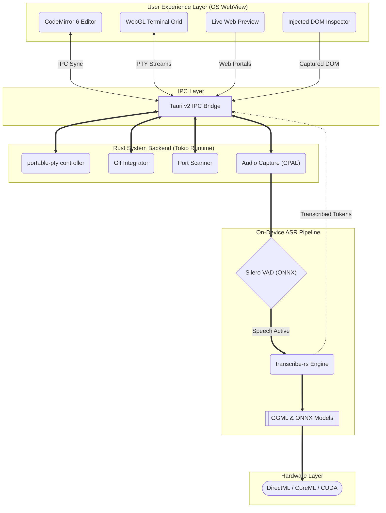

  
  
  # Fit
  *The Ultra-Lightweight, AI-Ready Development Workspace*
  
  
  
  
  
  

  ⭐ If you like this project, star it on GitHub!

  [Overview](#overview) • [Features](#features) • [Architecture](#architecture)

Fit is a new approach to the developer workspace. Modern IDEs consume hundreds of megabytes of memory before you type your first line of code, shipping bloated copies of browser engines to render static text. Fit replaces browser-level overhead with native operating system rendering, shrinking the idle footprint to **~10 MB RAM**.

Built on Tauri 2.0 and Rust, Fit couples an asynchronous Rust core with a React 19 interface to deliver a single-window workstation with built-in terminals, Git integration, live preview, and fully local voice-to-code dictation.

## Overview

Fit leverages system-level webviews instead of embedding custom browser engines, drastically reducing resource waste. 

| Parameter | Fit | Traditional Electron IDEs | Legacy CLI Editors |
| :--- | :--- | :--- | :--- |
| **Idle Memory** | **~10 MB** | 300 MB – 1 GB+ | 15 MB – 50 MB |
| **Startup Time** | **< 100ms** | 2 – 5+ seconds | < 50ms |
| **Engine Core** | Native WebView | Embedded Chromium | Custom Terminal UI |
| **Voice Dictation** | **On-Device ONNX** | Cloud API or None | None |
| **Terminal Grid** | **WebGL (xterm.js)** | Software Canvas | Subshell Spawn |
| **Live Preview** | **Integrated Scanner** | External Browser | Shell Redirect |

## Features

- **On-Device Voice-to-Code**: Write code hands-free without sending your voice data to external servers. Uses local Silero Voice Activity Detection (VAD) and ONNX speech-to-text models processing audio on device via DirectML or CoreML.
- **Hardware-Accelerated Terminal Grid**: Run shell environments side-by-side with minimal latency using `xterm.js` WebGL and Canvas addons.
- **Version Control & Workspace Editor**: Manage changes and edit code in a single window with CodeMirror 6, providing instant syntax highlighting and Git interface integration.
- **Live Preview & DOM Inspector**: Preview web layouts and debug elements without switching windows. Automatically discovers active development environments and injects a lightweight debugger script into the preview frame.

## Architecture

Fit is designed around a lightweight IPC layer connecting a powerful Rust system backend with a fast React user experience layer.

